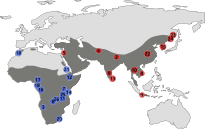
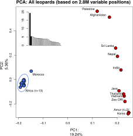
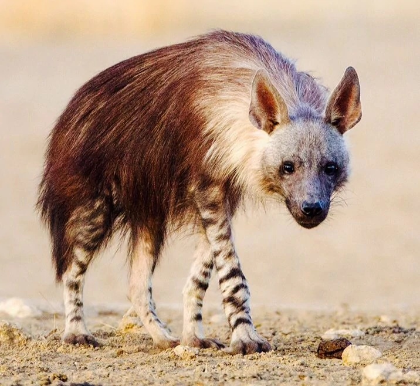
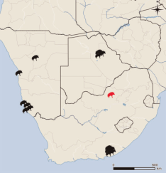
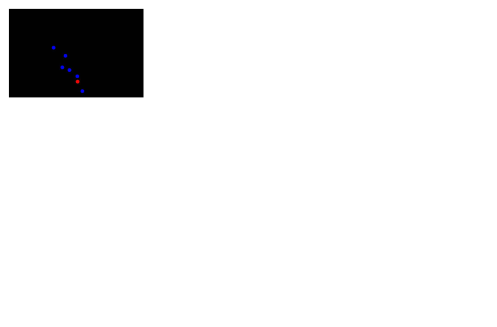
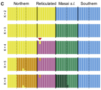

<!-- adding bold and italic options -->

## Phylogenetics and population genetics lectures

- Key concepts and Single locus phylogenetics
- Multi-locus phylogenetics
- **Population structure**
  - **Theory**
  - **Methods**
  - **Discoveries**
- Conservation genetics

---

## How does the tree form: lineage sorting

---

## How does the tree form: lineage sorting

---

## How does the tree form: lineage sorting

---

## How does the tree form: lineage sorting

---

## How does the tree form: lineage sorting

---

## Population structure

- Phylogenetic approaches less suited to recent population divergence events
- Insufficient time for lineage sorting
- After population isolation, allele frequencies in subpopulations will diverge under drift
- Differences in allele frequencies provide a way of identifying populations and measuring their divergence
- The extent of structuring depends on the magnitude of drift and gene flow
- Structure can still persist with low level gene flow

---

## Simulator

<iframe src = 'https://www.whfreeman.com/BrainHoney/Resource/6716/SitebuilderUploads/Hillis2e/Student%20Resources/Animated%20Tutorials/pol2e_at_1502_genetic_drift_simulation/pol2e_at_1502_genetic_drift_simulation.html' height='600px'></iframe>

---

## Why is it important?

### Populations play a central role in:
  - Evolution
  - Ecology
  - Conservation

### We need to know:
  - How many populations there are
  - Where do they occur spatially
  - How divergent are they
  - Do they exchange migrants

--- .segue .dark 

## Population structure - methods

---

## Getting the data

### Data is almost always multilocus. Many approaches have been and gone

- RAPDs
- RFLPs
- AFLPs
- Microsatellites

### Current methods are all single nucleotide polymorphism (SNP) based

- RADseq
- SNP array capture
- Whole genome resequencing

---

## Fst

- Fundamental approach
- Measures change in expected heterozygosity for subpopulations vs a single (big) population
- Ranges from 0 (no subpopulations) to 1 (subpopulations fixed for different alleles)
- Classically a single locus method, can be adapted for multiple loci
- Especially useful for detecting selection and other processes

--- &twocol

## Principal components analysis (PCA)

*** =left

- used for decades, modern implementation introduced in 2006
- Analysis of individuals
- model free (does not assume populations)
- Input is individual genotypes
- PCA find a single continuous variable that explains largest proportion of the variation (PC1)
- PC2 explains largest proportion not explained by PC1, etc...
- Allows exploration of where the populations are

*** =right

---

## STRUCTURE

- Introduced in 2000
- NGSadmix is STRUCTURE adapted for whole genome data
- User tells program the number of populations (K)
- Input is individual genotypes
- STRUCTURE assigns individuals to K populations maximising Hardy-Weinberg and linkage equillibrium
- Also allows individuals to be admixed
- Major challenge is determining K: either need strong prior knowledge, or test a range

--- &vcenter

## STRUCTURE example

--- .segue .dark 

## Population structure: discoveries

--- &twocol

## Leopards

*** =left

- Most widely distributed big cat
- Fossil record indicates African origin
- No range wide population genetics study
- 26 museum and modern genomes
- 8 subspecies, more or less supported by mtDNA
- African plus 7 Asian subspecies

*** =right

--- &twocol

## Leopards

*** =left

*** =right

--- &twocol

## Leopards

*** =left

*** =right

---

## Leopard reading

<embed src="./assets/img/Paijmans et al. - 2021 - African and Asian leopards are highly differentiated at the genomic level.pdf" title="plot of chunk unnamed-chunk-16" width="100%" height="500" type="application/pdf" />

--- &twocol

## Brown hyena (*Parahyeana brunnea*)

*** =left

- Rarest of 4 hyena species
- Southern African endemic
- Listed near threatened by IUCN
- Very low genetic diversity
- Previous msat studies found no detectable structure
- Hence no management units for conservation

*** =right

--- &twocol

## Brown hyena (*Parahyeana brunnea*)

*** =left

*** =right

---

## Brown hyena (*Parahyeana brunnea*)

---

## Brown hyena reading

<embed src="./assets/img/Westbury et al. - 2018.pdf" title="plot of chunk unnamed-chunk-21" width="100%" height="500" type="application/pdf" />

--- &twocol

## Tiger sharks

*** =left

- Oceanic shark
- Apex predator, ecologically flexible
- Global distribution
- Some show seasonal migration
- Can move 1000's km

*** =right

--- bg:white

## Tiger sharks

---

## Tiger shark reading

<embed src="./assets/img/esab046.pdf" title="plot of chunk unnamed-chunk-25" width="100%" height="500" type="application/pdf" />

--- &twocol

## Giraffes

*** =left

- Confused subspecies taxonomy
- Nine subspecies more or less accepted
- Overall listed as vulnerable by IUCN
- Some subspecies are critically endangered
- Previous multilocus phylogenetics study proposed for species
- Controversial!

*** =right

--- &twocol

## Giraffes

*** =left

*** =right

--- &twocol

## Giraffes

*** =left

*** =right

---

## Giraffes

---

## Giraffe reading

<embed src="./assets/img/giraffe.pdf" title="plot of chunk unnamed-chunk-32" width="100%" height="500" type="application/pdf" />

--- &thankyou

## Next time

**Conservation genetics**

